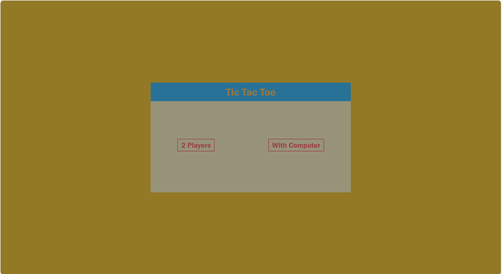
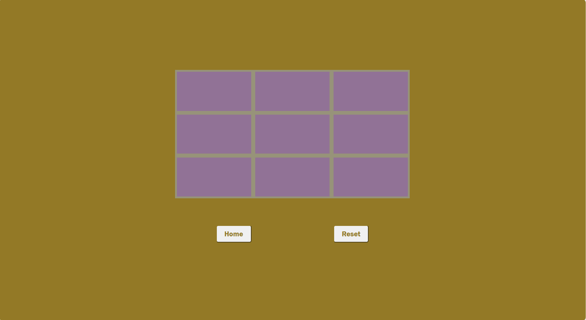
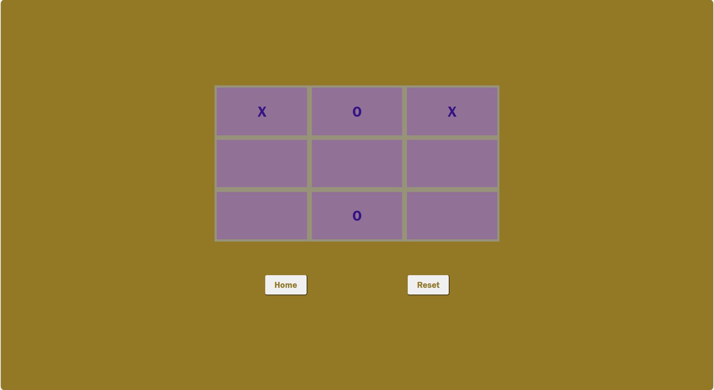

# Tic Tac Toe Web Application

1. A basic Tic Tac Toe Game.
1. Made with HTML CSS AND Javascript.
1. Responsive to different screen sizes using media queries.

## Features 🚀

1. Easy to Use.
1. Maximum Engagement

## How to Use 🤔

1. Download or clone this repository onto your local machine.
1. Open `index.html` file located at the `./index.html` using a web browser.
1. Select the type i.e, With Player or Computer.
1. If you are playing with another player then click on an empty box and wait for the other player to make their move. Then repeat the same step.
1. If you are playing with computer then click on an empty box and wait for the computer to make their move. Then repeat the same step.

## Preview This Project

## <a href="https://codequillcrafts.github.io/Tic-Tac-Toe" target=_blank>View Live At Github Pages</a>
## <a href="https://tictactoe-codequillcrafts.netlify.app/" target=_blank>View Live At Netlify</a>